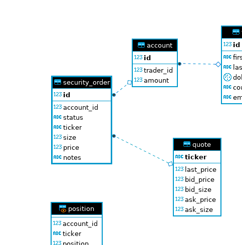
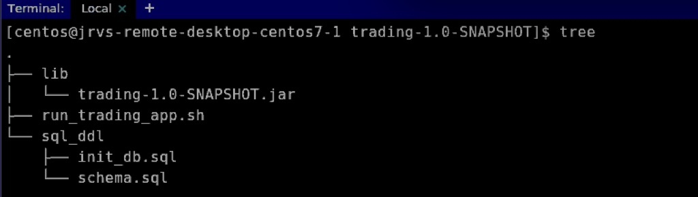
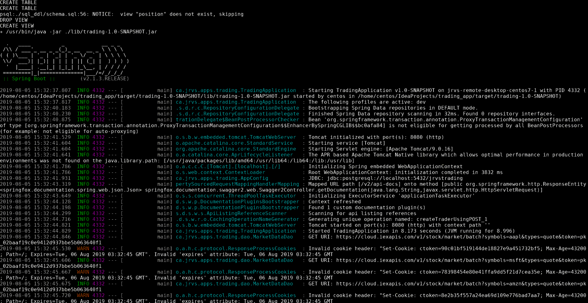
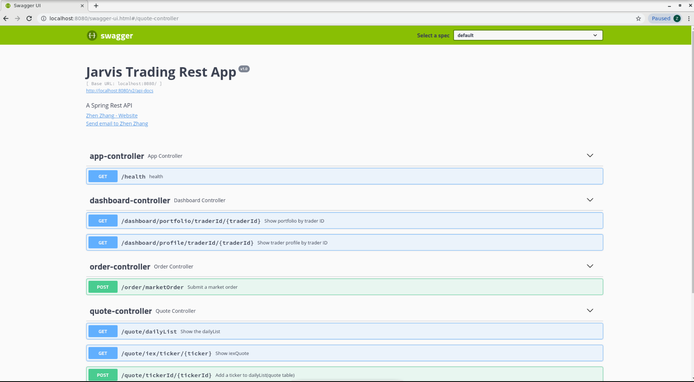

# Trading Application
# Introduction
Trading Application is a trading platform simulation that allows traders to trade securities. By building REST APIs using Springboot, this application can implement the following functions:
- Manage trader information and accounts.
- Execute security orders (e.g. buy/sell stocks).
- Process data in batch and real-time.  

# Quick Start
## Technologies  
- Docker (17.05 or higher which support multi-stage build)
- Java 1.8
- Maven
- Springboot
- PostgreSQL
- CentOS 7
- IEX token for getting market data (`https://iexcloud.io/docs/api/`)  
## PSQL database init
- Create database  
`psql -h $PSQL_HOST -U $PSQL_USER -f ./sql_ddl/init_db.sql`  
- Create tables  
`psql -h $PSQL_HOST -U $PSQL_USER -d jrvstrading -f ./sql_ddl/schema.sql`  
- ER diagram   
  
## Start the Springboot trading app
- Run the app in terminal  
1.Package Maven project: `mvn clean package -DskipTests`  
2.Change directory: `cd target/trading-1.0-SNAPSHOT`, like this:  
  
3.Start the app: `bash -x ./run_trading_app.sh dev localhost postgres passowrd IEX_token`  
- Run the app in IDEA  
1.Setup system env:   
```export PSQL_URL=jdbc:postgresql://localhost:5432/jrvstrading
export PSQL_USER=postgres
export PSQL_PASSWORD=password
export SPRING_PROFILES_ACTIVE=dev
export IEX_PUB_TOKEN=xxxx
```  
2.Create a java class named TradingApplication to configure Spring Boot, manually configure JdbcTemplate and Datasource.  
3.Run the main method, Our main method delegates to Spring Boot's Spring Application class by calling run. SpringApplication bootstraps the application, starting Spring, which, in turn, starts the auto-configured Tomcat web server, then the app will be successfully running like this:   
  
  

After the app is running successfully in either terminal or IDEA, we will see the generated documentation rendered by Swagger UI on pointing the browser to http://localhost:8080/swagger-ui.html, like this:    

  
# REST API Usage
## Swagger
As we know, Spring Boot makes developing RESTful services ridiculously easy, and using Swagger makes documenting your RESTful services easy. So in this Trading App Spring Boot project, I try to use Swagger 2 to generate REST API documentation for it.
Swagger 2 is an open-source project used to describe and document RESTful APIs. Java code is bundled by the Swagger UI project to display the REST API on the browser, such as Chrome. Besides rendering documentation, Swagger UI allows other API developers or consumers to interact with the API resources without having any of the implementation logic in place.  
To bring it in, we need the following dependency declaration in our Maven POM.
```
<dependency>
    <groupId>io.springfox</groupId>
    <artifactId>springfox-swagger2</artifactId>
    <version>2.9.2</version>
    <scope>compile</scope>
</dependency>
<dependency>
    <groupId>io.springfox</groupId>
    <artifactId>springfox-swagger-ui</artifactId>
    <version>2.9.2</version>
    <scope>compile</scope>
</dependency>
```
In addition, create a Docket bean (SwaggerConfig.java) in a Spring Boot configuration to configure Swagger 2 for the application. A Springfox Docket instance provides the primary API configuration with sensible defaults and convenience methods for configuration.  

## App Controller
App Controller is just a test controller to make sure the app is successfully running. So there is only one endpoints in it.
```
| Request Type | URI          | Endpoint explaination                                        |
| ------------ | ------------ | ------------------------------------------------------------ |
| GET          | /health      | Test if the Springboot trading app is successfully running.  |
```
## Dashboard Controller
Dashboard Controller mainly implements the trader information display operation, such as portfolio and trader profile.
```
| Request Type | URI                                      | Endpoint explaination            |
| ------------ | ---------------------------------------- | -------------------------------- |
| GET          | /dashboard/portfolio/traderId/{traderId} | Show portfolio by trader ID.     |
| ------------ | ---------------------------------------- | ---------------------------------|
| GET          | /dashboard/profile/traderId/{traderId}   | Show trader profile by trader ID.|
```
## Order Controller
Order Controller only contains one endpoint to implement the execution of a market order.
```
| Request Type | URI                 | Endpoint explaination                                         |
| ------------ | ------------------- | ------------------------------------------------------------- |
| POST         | /order/marketOrder  | Execute a market order, then return the result securityOrder. |
```
## Quote Controller
Quote Controller allows users to implement CRU operations of quotes.
```
| Request Type | URI                        | Endpoint explaination                                         |
| ------------ | -------------------------- | --------------------------------------------------------- --- |
| GET          | /quote/dailyList           | Show dailyList for trading system.                            |
| ------------ | -------------------------- | -------------------------------------------------------- ---- |
| GET          | /quote/iex/ticker/{ticker} | Show iexQuote for a given ticker or symbol.                   |
| ------------ | -------------------------- | -------------------------------------------------------- ---- |
| POST         | /quote/tickerId/{tickerId} | Init a new ticker in the dailyList.                           |   
| ------------ | -------------------------- | -------------------------------------------------------- ---- |
| PUT          | /quote/                    | Manualy update a quote in the quote table for testing purpose.|
| ------------ | -------------------------- | ------------------------------------------------------------- |
| PUT          | /quote/iexMarketData       | Update all quotes in the quote table. Use IEX trading API as  |
|              |                            | market data source.                                           |
```
## Trader Controller
Trader Controller contains five endpoints to implements CUD operations of traders and funds.
```
| Request Type | URI                                                 | Endpoint explaination                           |
| ------------ | --------------------------------------------------- | ----------------------------------------------- |
| DELETE       | /trader/traderId/{traderId}                         | Delete a trader IFF its account amount is 0 and |
|              |                                                     | no open positions. Also delete the associated   |
|              |                                                     | account and securityOrders.                     |
| ------------ | --------------------------------------------------- | ----------------------------------------------- |
| POST         | /trader/                                            | Create a trader & an account with DTO.TraderId &|
|              |                                                     | AccountId are auto generated by the database,and|      |
|              |                                                     | they should be identical. Assume each trader has|
|              |                                                     | exact one account.                              |
| ------------ | --------------------------------------------------- | ----------------------------------------------- |
| POST         | /trader/firstname/{firstname}/lastname/{lastname}   | Create a trader & an account.                   |
|              | /dob/{dob}/country/{country}/email/{email}          |                                                 |
| ------------ | --------------------------------------------------- | ----------------------------------------------- |
| PUT          | /trader/deposit/traderId/{traderId}/amonut/{amount} | Deposit a fund to the account with given trader |
|              |                                                     | ID. Deposit amount must be greater than 0.      |
| ------------ | --------------------------------------------------- | ----------------------------------------------- |
| PUT          | /trader/withdraw/traderId/{traderId}/amonut/{amount}| Withdraw a fund from the account with given     |
|              |                                                     | traderId. Withdraw amount must not exceed       |
|              |                                                     | account amount.                                 |
```
# Architecture
- Component Diagram  

  
- Tomcat Web Container  
Tomcat is a built-in embedded web server of Springboot. When we setup the dependency `spring-boot-starter-web` in pom.xml, the dependency `spring-boot-starter-tomcat` is included. By default, the auto-configurer sets up the project with Tomcat. We simply hit the run button, and the web server starts up with the application.
- Controller layer  
 Building RESTful web services with Springboot, HTTP requests from the user are all handled by a controller, then appropriate responses are returned. These components are easily identified by the @Controller annotation. For example, the AppController handles GET requests for `/health` by returning a String `I am very healthy!`.   
- Service layer  
The components are identified by the @Service annotation, which means they are holding the business logic. Service layer mainly receives the request from controller layer and process the request to DAO layer
- Dao layer  
The components like AccountDao, PositionDao, QuoteDao, SecurityOrderDao and TraderDao are designed to talk to the database. The main function of these components are to perform CRUD operations on trading against the PostgreSQL database with a set of  entities. The MarketDataDao component is designed to perform market data query operation using httpClient from IEX cloud.


# Improvement
- Design the interface of each layer to minimize the ripple effect between different layers.
- Add transaction management so if we have calls to multiple data access objects we can specify that they occur within the same transaction, and  more importantly it means the data retrieved is going to be more consistent.
- 


